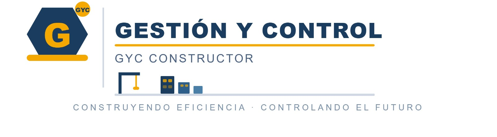

 

# 👷🏽‍♂️ GYC CONSTRUCTOR
> Sistema para la gestión y administración de proyectos de construcción
---

## 📋 Descripción

**GYC Constructor** nace a  partir de la creatividad de 4 integrantes ingeniosos y comprometidos que actualmente 
son estudiantes de ADSO, su objetivo es buscar la optimización de la gestión de proyectos 
de construcción mediante el control de obras, materiales, personal, cronogramas y documentación en una sola plataforma
aplicando además la metodología **Scrum** para tener un sistema muy efectivo. 
Cabe resaltar que este proyecto es académico, y ademas guiado y asesorado por la Instructora **Maria del Pilar Moreno**

---

## 🎯 Objetivo General

Desarrollar un sistema que permita mejorar la administración de proyectos de construcción, optimizando el seguimiento de actividades y facilitando la toma de decisiones.

----

## 👩🏽‍🎓🧑‍🎓👩🏻‍🎓👨🏻‍🎓 Grupo de Trabajo
- Kevin S. Morris
- Julián Galvis
- Laura Rubiano Portilla
- Anyi Lorena Hernández
> **Ficha 3466002** SENA (Servicio Nacional de Aprendizaje)
>Tecnología en Análisis y Desarrollo de Software
---

## 📄Documentación 
Nos regimos por medio de la Norma IEEE 830 y al momento contamos con la matriz de trazabilidad donde se definieron los Requisitos Funcionales (RF) y los Requisitos No Funcionales (RNF) dividiéndolos en 7 módulos principales, también contamos con una propuesta de cronograma donde se especifica cada sprint, tiempo e historia de usuario.

---
## 📆 Estado del proyecto
🛠️ En desarrollo

---

## 📁 Próximos avances o mejoras
- Casos de Uso
- Diagramas UML 
